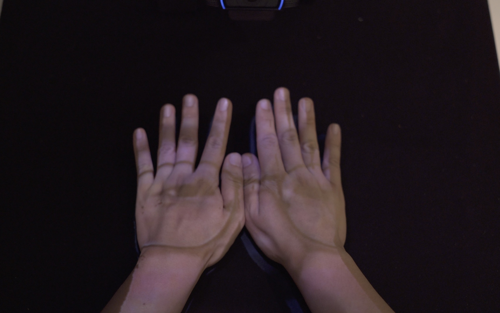

# Face Palm (2018)

## Description
Face Palm is an interactive installation that projects the audience's face onto his/her palms. It is intended to simulate the interaction of looking down on reflective surfaces with projection mapping on hands. It provides a meditative environment with the surreal experience of the mirroring and distortions by the palm-top geometry.

## Notes
For the installation, I used Madmapper to map the Processing sketch to the full table surface. Finer adjustments for image warping should be made through this [coordinate file](https://github.com/yz3440/face-palm/blob/main/Face_Palm/data/coords.json) which OpenCV reads from.

This work is completed under the course [Sensors, Body, & Motion](http://www.sbm.nyuadim.com/) taught by [Aaron Sherwood](https://aaron-sherwood.com/) at NYU Abu Dhabi.

## Demo
-> [Video](https://www.youtube.com/watch?v=vZ1iL9T_t7g)
